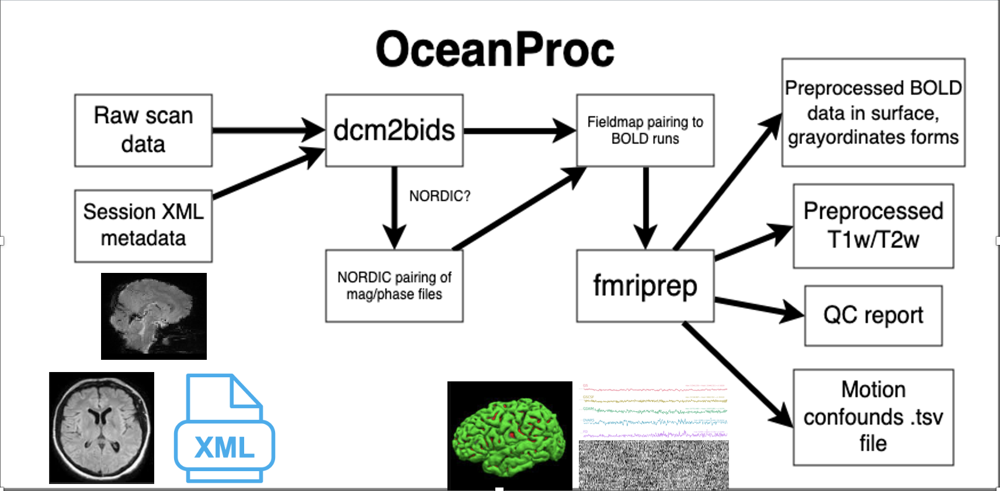

# oceanproc

## What is oceanproc?

`oceanproc` is a command-line utility that combines the utility of `dcm2bids` and `fmriprep`, along with some WashU-environment-specific code, to streamline the process of preprocessing neuroimaging data. 



`oceanproc` is meant to make the process of setting up a BIDS-compliant dataset as easy as possible by allowing for data fresh off the scanner to be used as input. As pictured in the diagram above, all the input that is needed is 1) the raw data, either in DICOM or NIFTI format, and 2) an XML file stored on CNDA containing usability scores for each scan (this is also used to pair fieldmaps to BOLD runs via a 'nearest neighbor' algorithm). 

Outside of the processing done by `fmriprep`, `oceanproc` can also handle the combining of [NORDIC mag/phase files](https://github.com/SteenMoeller/NORDIC_Raw/blob/main/README.md). 


## Usage

```
usage: oceanproc [-h] [--version] --subject SUBJECT --session SESSION
                 [--source_data SOURCE_DATA] [--skip_dcm2bids]
                 [--usability_file USABILITY_FILE]
                 [--longitudinal LONGITUDINAL [LONGITUDINAL ...]]
                 [--skip_fmap_pairing] [--skip_segmentation] [--skip_preproc]
                 [--skip_event_files] [--export_args EXPORT_ARGS]
                 [--keep_work_dir] [--debug_mode]
                 [--fmap_pairing_file FMAP_PAIRING_FILE] --bids_path BIDS_PATH
                 --derivs_path DERIVS_PATH
                 [--derivs_subfolder DERIVS_SUBFOLDER] --bids_config
                 BIDS_CONFIG [--nordic_config NORDIC_CONFIG]
                 [--nifti | --no-nifti] [--anat_only | --no-anat_only]
                 [--fd_spike_threshold FD_SPIKE_THRESHOLD]
                 [--skip_bids_validation | --no-skip_bids_validation]
                 [--fs_subjects_dir FS_SUBJECTS_DIR]
                 [--allow_uneven_fmap_groups]
                 [--precomputed_derivatives [DERIVATIVES ...]] --work_dir
                 WORK_DIR --fs_license FS_LICENSE
                 [--image_version IMAGE_VERSION] [--infant | --no-infant | -I]
                 [--bibsnet_image_path BIBSNET_IMAGE_PATH]
                 [--bibsnet_work BIBSNET_WORK]
```